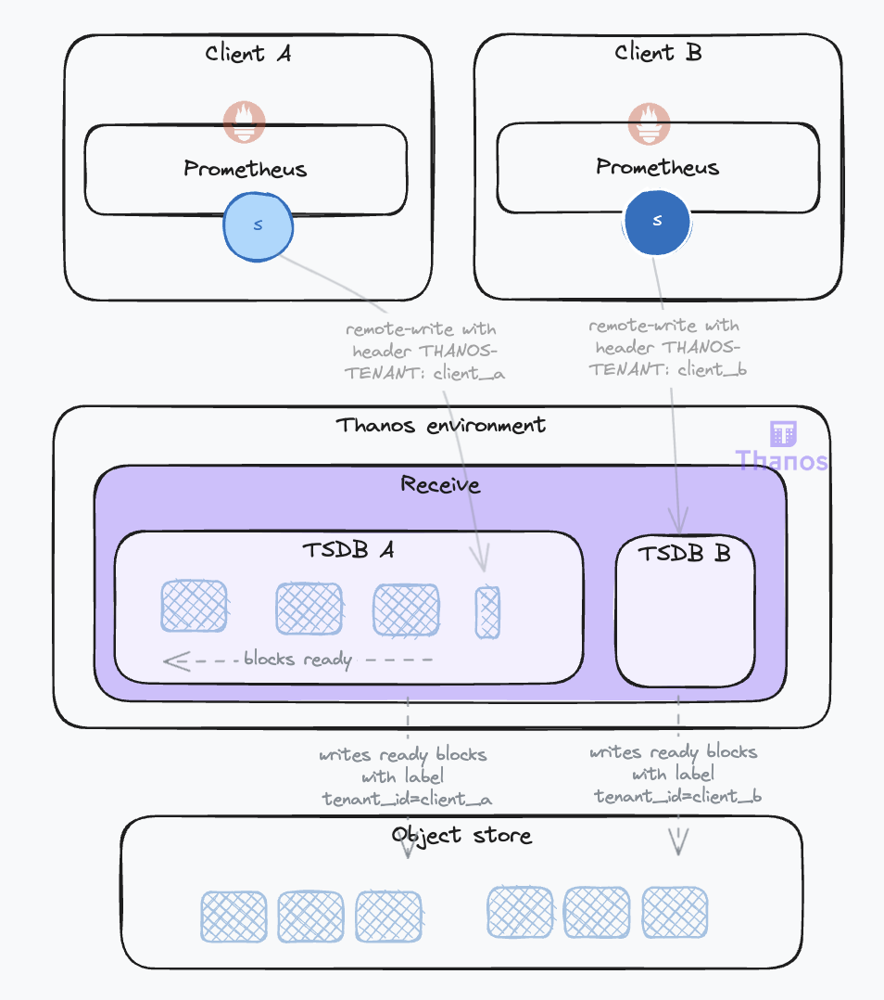
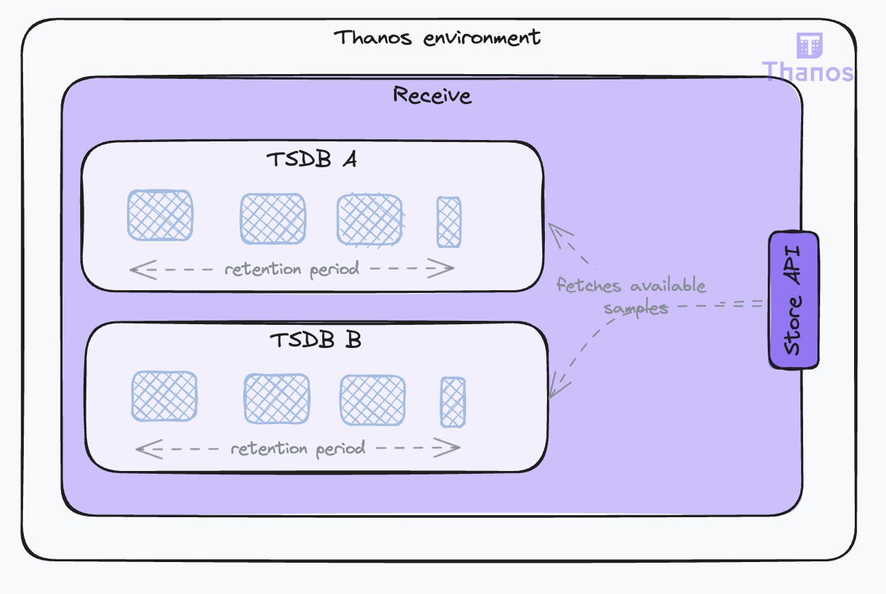
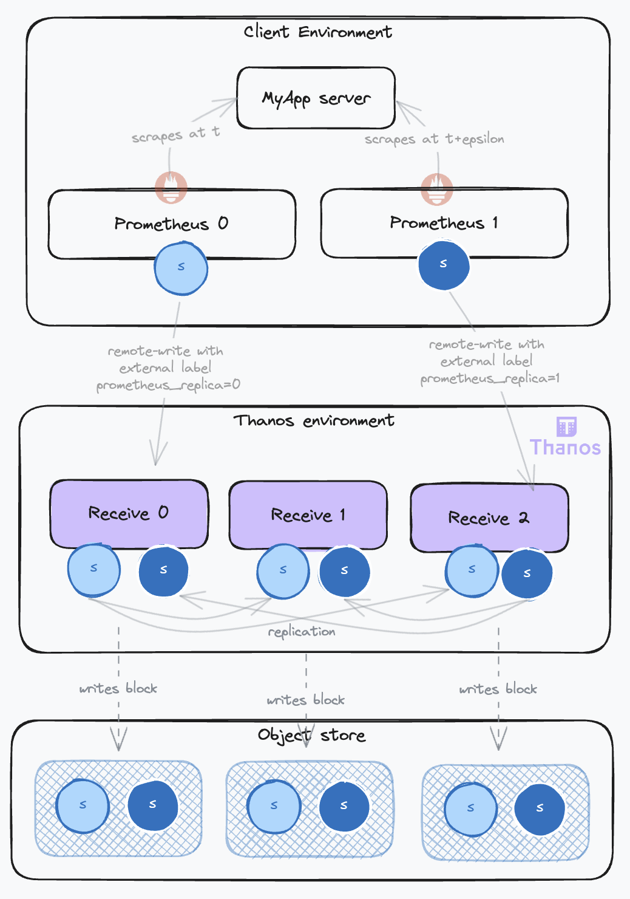
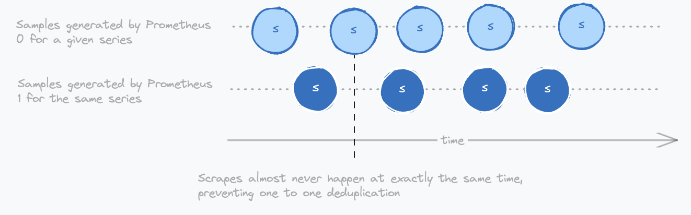
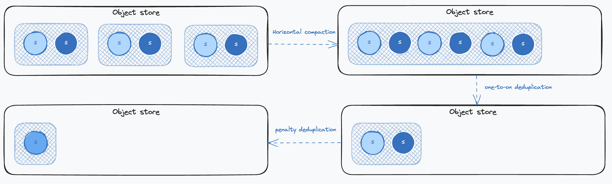
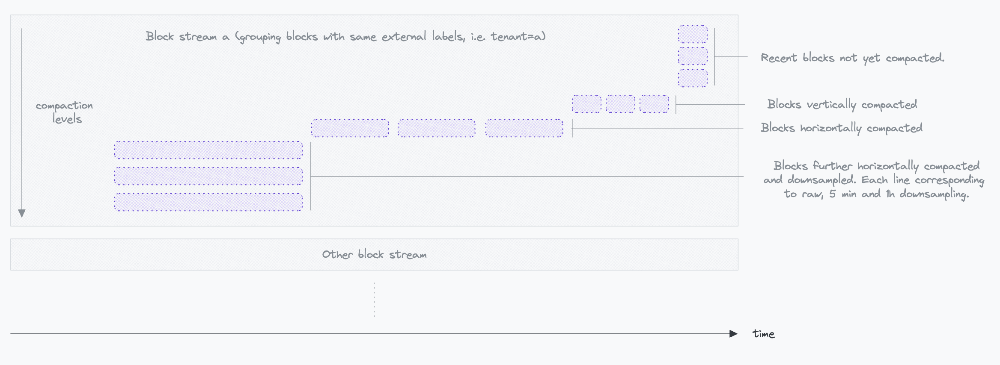

## Life of a sample in thanos, and how to configure it – Data Management – Part II

### Introduction

In the [first part](2023-11-20-life-of-a-sample-part-1.md) of this series, we followed the life of a sample from its inception in a Prometheus server located beyond our network boundaries to our Thanos Receivers. We will now explore how Thanos manages the data ingested by the Receivers and optimizes data in the object store for reduced cost and fast retrieval.

Let's delve into these topics and more in the second part of the series.

### Preparing samples for object storage: building chunks and blocks

#### Using object storage

A key feature of Thanos is its ability to leverage economical object storage solutions like AWS S3 for long-term data retention. This contrasts with Prometheus's typical approach of storing data locally for shorter periods.

The Receive component is responsible for preparing data for object storage. Thanos adopts the TSDB (Time Series Database) data model, with some adaptations, for its object storage. This involves aggregating samples over time to construct TSDB Blocks. Please refer to the annexes of the [first part](2023-11-20-life-of-a-sample-part-1.md) if this vocabulary is not clear for you.

These blocks are built by aggregating data over two-hour periods. Once a block is ready, it is sent to the object storage, which is configured using the `--objstore.config` flag. This configuration is uniform across all components requiring object storage access.

On restarts, the Receive component ensures data preservation by immediately flushing existing data to object storage, even if it doesn't constitute a full two-hour block. These partial blocks are less efficient but are later optimized by the compactor as we'll see later.

The receive also allows to [isolate ingested data](https://thanos.io/tip/components/receive.md/#tenant-lifecycle-management) coming from different tenants. The tenant can be identified in the request by different means: a header (`--receive.tenant-header`), a label (`--receive.split-tenant-label-name`) or a certificate (`--receive.tenant-certificate-field`). Their data is ingested into different TSDBs instances (you'll hear about the multiTSDB). The benefits are twofold:

* It allows for parallelization of the block building process, especially on the compactor side as we'll see later.
* It allows for smaller indexes. Indeed, labels tend to be similar for samples coming from the same source, leading to more effective compression.



When a block is ready, it is uploaded to the object storage with the block external label defined by the flag `--receive.tenant-label-name`. This corresponds to the `thanos.labels` field of the [block metadata](https://thanos.io/tip/thanos/storage.md/#metadata-file-metajson). This will be used advantageously by the Compactor to group blocks together as we'll see later.

#### Exposing local data for queries

During the block-building phase, the data isn't accessible to the Store Gateway as it has not been uploaded to the object store yet. Hence, the Receive component also serves as a data store, making the local data available for query through the `Store API`. This is a common gRPC API used across all Thanos components for time series data access, set with the `--grpc-address` flag. The receive will serve all data is has. The more data it serves, the more resources it will use for this duty in addition of ingesting client's data. 



The amount of data the Receive component serves can be managed through two parameters:

* `--tsdb.retention`: Sets the local storage retention duration. The minimum is 2 hours, aligning with block construction periods.
* `--store.limits.request-samples` and `--store.limits.request-series`: These limit the volume of data that can be queried. Exceeding these limits will result in the query being TRUNCATED OR DENIED??, ensuring system stability. 

Key points to consider:

* The primary objective of the receive is to ensure reliable data ingestion. And the more data it serves through the store API, the more resources it will use for this duty in addition to ingesting client data. You should set the retention duration to the minimum required for your use case to optimize resources allocation. The minimum value for 2 hours blocks would be 4 hours retention to account for availability in the store Gateway after the block is uploaded to object storage.
* Even when the retention duration is short, your receive instance could be averwhelmed by a query selecting too much data. You should set limits in place to ensure the stability of the receive instances. These limits must be carefully set to enable store API clients to retrieve the data they need while preventing resource exhaustion.

### Maintaining data: compaction, downsampling, and retention

#### The need for compaction

The Receive component implements many strategies to ingest samples reliably. However this can result in unoptimized data in object storage. This is due to:

* Inefficient partial blocks sent to object storage on shutdowns
* Duplicated data when replication is set.  Several Receive instances will send the same data to object storage.
* Incompete blocks (invalid blocks) sent to object storage when the receive fails in the middle of an upload.

The following schema illustrates the impact on data expansion in object storage when samples from a given target are ingested from a high availabity prometheus setup (with 2 instances) and replication is set on the receive (factor 3):



This leads to a 6 times increase in data volume! This is where the Compactor comes into play.

The Compactor component is responsible for maintaining and optimizing data in object storage. It's a long-running process that can be configured to wait for new blocks with the `--wait` flag. It also needs access to the object storage with the `--objstore.config` flag.

Under normal operation conditions, the Compactor will check for new blocks every 5 minutes. It will then process these blocks in a structured manner, compacting them according to defined settings that we'll see in the next sections.

#### Compaction modes

Compaction consists in merging blocks that have overlapping or adjacent time ranges. This is called **horizontal compaction**. Using the [Metadata file](https://thanos.io/tip/thanos/storage.md/#metadata-file-metajson) that contains the minimum and maximum timestamp of samples in the block, the compactor can determine if two blocks overlap. If they do, they are merged into a new block. This new block will have its compaction level index increased by one. So from two adjacent blocks of 2 hours, we will get a new block of 4 hours. 

During this compaction, the compactor will also deduplicate samples. This is called [vertical compaction](https://thanos.io/tip/components/compact.md/#vertical-compactions). The compactor provides two deduplication modes:

* `one-to-one`: This is the default mode. It will deduplicate samples that have the same timestamp and the same value. But different replica label values. The replica label is configured by the `--deduplication.replica-label` flag. This flag can be repeated to account for several replication labels. Usually set to `replica`, make sure it is set up as external label on the Receivers with the flag `--label=replica=xxx`. The benefit of this mode is that it is straightforward and will remove replicated data from the receive. However, it is not able to remove data replicated by high availability prometheus setups. Because, these samples will rarely be scraped at exactly the same timestamps.
* `penalty`: This a more complex deduplication algorithm that is able to deduplicate data coming from high availability prometheus setups. It can be set with the `--deduplication.func` flag and requires also setting the `--deduplication.replica-label` flag that identifies the label that contains the replica label. Usually `prometheus_replica`. Here is a schema illustrating how Prometheus replicas generate samples with different timestamps that cannot be deduplicated with the `one-to-one` mode:



Getting back to our example illustrating the data duplication happening in the object storage, here is how each compaction process will impact the data:




You want to deduplicate data as much as possible because it will lower your object storage cost and improve query performance. But using the penalty presents some limitations. Have a look at (https://thanos.io/tip/components/compact.md/#vertical-compaction-risks)

#### Downsampling and retention

The compactor is also optimizing data read for long range queries. If you are querying data for several months, you don't need the typical 15s raw resolution. Processing such a query will be very inefficient as it will retrieve a lot of unnecessary data that you won't be able to visualize with such details in your UI. And it may even in worst case scenarios kill some components of your Thanos setup due to memory exhaustion.

To enable performant long range queries, the compactor can downsample data using `--retention.resolution-*` flags. It supports two downsampling levels: 5m and 1h. These are the resolutions of the downsamples series. They will tipically come on top of the raw data, so that you can have both raw and downsampled data. It will enable you to spot abnormal patterns over lang range queries and then zoom into specific parts thanks to the raw data. We'll see later how to configure the query to use the downsampled data.

Key points to consider:

* Downsampling if not for reducing the volume of data in object storage. It is for improving lang range query performance, making your system more versatile and stable.
* Thanos recommends having the same retention duration for raw and downsampled data. This will enable you to have a consistent view of your data over time.
* As a rules of thumb, you can consider that each downsampled data increases one fold the storage need. Most often less than that, but depending on your data, plan for the worst case.

#### The compactor UI and the block streams

All blocks covering the same time range are not compacted together. Instead, the Compactor organizes them into distinct [compaction groups or block streams](https://thanos.io/tip/components/compact.md/#compaction-groups--block-streams). The key here is to leverage external labels to group data originating from the same source. This strategic grouping is particularly effective for compacting indexes, as blocks from the same source tend to have nearly identical labels.

The Compactor's functionality and the progress of its operations can be monitored through the Block Viewer UI. This web-based interface is accessible if the Compactor is configured with the `--http-address` flag. Additional UI settings are controlled via `--web.*` and `--block-viewer.*` flags. The Compactor UI provides a visual representation of the compaction process, showing how blocks are grouped and compacted over time. Here’s a glimpse of what the UI looks like:



Occasionally, some blocks may display an artificially low level in the UI, appearing lower in the stream compared to adjacent blocks. This scenario often occurs in situations like rolling receiver upgrades, where receivers restart sequentially, leading to the creation and upload of partial blocks to the object store. The Compactor then vertically compacts these blocks as they arrive, resulting in a temporary increase in compaction levels. When these blocks are horizontally compected with adjactent blocks, they will also be displayed lower down the stream.

By default, the Compactor’s strategy involves compacting 2-hour blocks into 8-hour blocks once they are available, then progressing to 2-day blocks, and so on, following a structured compaction timeline.

### Exposing buckets data for queries: the store gateway and the store API

#### Exposing data for queries

HOW DOES THE STORE KNOWS NEW BLOCKS ARE AVAILABLE? WHAT DELAY? SYNC MECHANISMS WITH THE RECEIVE? CAN THE CACHE BECOME INVALID?

The Store Gateway is acting as a facade for the object storage, making bucket data accessible via the Thanos Store API, a feature first introduced with the Receive component. The store exposes the store API with the `--grpc-address` flag.

The Store Gateway requires access to the object storage bucket to retrieve data, set with the `--objstore.config` flag. Additionally, it utilizes caches to efficiently store indexes and chunks of data.

#### Retrieving samples from the object storage

Consider the simple following query done on the Querier:

```promql
# Between now and 2 days ago, compute the rate of http requests per second, filtered by method and status
rate(http_requests_total{method="GET", status="200"}[5m])
```

This PromQL query will be parsed by the Querier that will emit a Thanos [Store API](https://github.com/thanos-io/thanos/blob/main/pkg/store/storepb/rpc.proto) request to the Store Gateway with the following parameters:

```proto
SeriesRequest request = {
  min_time: [Timestamp 2 days ago],
  max_time: [Current Timestamp],
  max_resolution_window: 1h,  // the minimum time range between two samples, relates to the downsampling levels
  matchers: [
    { name: "__name__", value: "http_requests_total", type: EQUAL },
    { name: "method", value: "GET", type: EQUAL },
    { name: "status", value: "200", type: EQUAL }
  ]
}
```

The Store Gateway processes this request in several steps:

* **Metadata processing**: The Store Gateway first examines the block [metadata](https://thanos.io/tip/thanos/storage.md/#metadata-file-metajson) to determine the relevance of each block to the query. It evaluates the time range (`minTime` and `maxTime`) and external labels (`thanos.labels`). Blocks are deemed relevant if their timestamps overlap with the query's time range and if their resolution (`thanos.downsample.resolution`) matches the query's maximum allowed resolution.
* **Index processing**: Next, the Gateway retrieves the [indexes](https://thanos.io/tip/thanos/storage.md/#index-format-index) of candidate blocks. This involves:
  * Fetching postings lists for each label specified in the query. These are inverted indexes where each label and value has an associated sorted list of all the corresponding time series. Example:
    * "__name__=http_requests_total": [1, 2, 3],
    * "method=GET": [1, 2, 6],
    * "status=200": [1, 2, 5]
  * Intersecting these postings lists to pinpoint series that match all query labels. In our example these are series 1 and 2.
  * Retrieving the Series section from the index for these series, which includes chunk information and their time ranges. Example:
    * Series 1: [Chunk 1: mint=t0, maxt=t1, fileRef=0001, offset=0], ...
  * Determining the relevant chunks based on their time range intersection with the query.
* **Chunks retrieval**: The Gateway then fetches the appropriate chunks, either from the object storage directly or from a chunk cache. When retrieving from the object store, the Gateway leverages its API to read only the needed bytes (i.e. using S3 range requests), bypassing the need to download entire chunk files. Then, the gateway streams selected chunks to the Querier.

Understanding the retrieval algorithm highlights the critical role of an external [index cache](https://thanos.io/tip/components/store.md/#index-cache) in the Store Gateway's operation. This is configured using the `--index-cache.config` flag. Indexes contain all labels and values of the block which can result in big sizes. When the cache is full, Last-In-First-Out (LIFO) eviction is applied. In scenarios where no external cache is configured, a portion of the memory will be utilized as a cache, managed via the `--index-cache.size` flag.

Moreover, the direct retrieval of chunks from object storage can be suboptimal, and result in excessive costs, especially with a high volume of queries. To mitigate this, employing a [caching bucket](https://thanos.io/tip/components/store.md/#caching-bucket) can significantly reduce the number of queries to the object storage. This chunk caching strategy is particularly effective when data access patterns are predominantly focused on recent data. By caching these frequently accessed chunks, query performance is enhanced, and the load on object storage is reduced.

#### Enhancing Store Performance through Sharding

The performance of Thanos Store components can be notably improved by managing concurrency and implementing sharding strategies.

Adjusting the level of concurrency can have a significant impact on performance. This is managed through the `--store.grpc.series-max-concurrency` flag for the allowed concurrent series requests on the store API. Other lower level concurrency settings are also available.

After having optimized the store processing, you can distribute the queries load using sharding strategies enabled by the relabel configuration. This approach involves processing different blocks on different Store instances. Here’s an example of how to set up sharding using the `--selector.relabel-config` flag:

```yaml
- action: hashmod
  source_labels:
    - __block_id
  target_label: shard
  modulus: 2 # number of store replicas
- action: keep
  source_labels:
    - shard
  regex: 0 # shard number
```

In this configuration, the `hashmod` action is used to distribute blocks across multiple Store instances (replicas) based on the `__block_id` label. The `modulus` should match the number of Store replicas you have. Each replica will then keep only the blocks that match its shard number, as defined by the `regex` in the `keep` action. This setup allows for a more balanced distribution of query processing, enhancing overall system performance. 

However, this sharding approach isn't a universal solution. One potential issue comes from the fact that series are grouped within a block based on their external labels, typically originating from the same data source. In such cases, if the load is predominantly from one source, sharding may be less effective. This is especially true for blocks that have undergone horizontal compaction and cover extensive time ranges, potentially resulting in an uneven query load on a single Store instance. OTHER SOLUTION? ADD RANDOM SET OF EXTERNAL LABELS AT THE SERIES LEVEL TO INCREASE THE NUMBER OF STREAMS?


