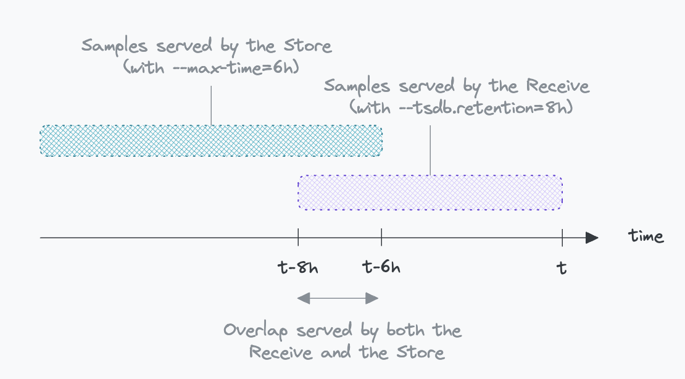

## Life of a sample in thanos, and how to configure it – Querying – Part III

### Querying data from the Thanos stores: the querier

#### Configuring Samples Access in the Querier

The Querier component in Thanos is entry point for samples retrieval. It is responsible for processing PromQL queries. This process involves:

* Parsing the query.
* Fetching data from Thanos stores.
* Processing and returning the query result.

Thanos stores, comprising the Receive component for recent data and the Store Gateway for older records, are configured using  the `--endpoint*` flags. As the Querier is unaware of which store owns what data, it distributes requests across all configured stores. 

<!-- schema -->

To prevent data overlap between the Receive component (handling data up to its TSDB retention period) and the Store Gateway (handling blocks exported to the object store), the `--max-time` flag is used in the Store Gateway. This flag ensures the Store Gateway does not serve data too recent and already covered by the Receive. However, a slight overlap is necessary to prevent data gaps:

WHAT HAPPENS TO thE ORIGINAL QUERY WHEN IT TRIGGERS STORE API LIMITS?

#### Deduplication and Partial Response Handling

The Querier receives data that may be duplicated. This can be the case when:

* The Receive component is configured with replication and recent data is requested. The query will receive the same data from multiple Receive instances as it fans out its requests to all Thanos stores.
* Some data is served by both the receive and the store gateway when the query time range overlaps with common time ranges served by both components.
* Some data come from high availability prometheus setups.

As a result, the querier may receive duplicated data from the receivers in case of duplication or high availability setups upstream. This is why the querier will deduplicate data before processing the query. Deduplicating data from high availability prometheusis requires setting the flag `--query.replica-label` to the label identifying replicas (commonly prometheus_replica). It uses the same algorithm as the compactor.

In a distributed environment, not all stores may successfully retrieve necessary samples. If partial responses occur, the behavior is controlled by `--query.partial-response`. By default, queries are aborted on partial responses, a sensible default for rule evaluations. However, for ad-hoc queries where availability is prioritized over consistency, setting --query.partial-response=warn allows the query to proceed with warnings visible in the Thanos Query UI, exposed by the Querier. It is the same as the Prometheus UI, adapted to Thanos.

WHY ARE THERE STORE API SETTINGS?

#### Downsampling and Query Efficiency

The Querier also dictates the level of downsampling permitted to the Store Gateway. Downsampling is disabled by default but can be enabled with `--query.auto-downsampling` on the Querier. The UI or tools like Grafana automatically calculate an appropriate 'step' for queries, influencing the `max_resolution_window` parameter in store API requests. For long-range queries, this feature enhances efficiency by reducing the volume of data processed, facilitating pattern detection over extended periods. Once a pattern is identified, zooming in provides more detailed data. Therefore, it is recommended to maintain equal retention for both raw and downsampled data for a comprehensive analysis range.

Let's see two examples of how the Querier handles downsampling:

* **A one hour range query**: Commonly, the UI requires 250 points to draw a graph. The UI computes a 14s step (3600s/250). From there, the Querier computes the `max_resolution_window` parameter to be sent to stores as the requested step divided by 5 as stated in the [documentation](https://thanos.io/tip/components/query.md/#auto-downsampling). In this case it will be 2s. Which is much lower than the first 5m level downsamplig. No dowsampled data will be fetched.
* **A one month range query**: The UI computes a 10368s (30d*24h*3600s/250) step. The querier sets the value of the `max_resolution_window` as 2074s (10368/5). This resolution is compatible with the 5m downsampled step (300s) but too low for the 1h downsampling (3600s). In this case, the store will return the 5m downsampled data.

Considering that the raw data has a 15s samplig period, using the 5m downsampled data will reduce the number of samples by a factor of 20 (300s/15s) and the 1h downsampled data will reduce the number of samples by a factor of 240 (3600s/15s). This drastically improves the query performance of long range queries.

#### Protecting from big queries

The querier is not able to plan 

Setting limits on stores, splitting ruler. WHAT IS THE QUERY LIMITS FOR?

#### Speeding up queries evaluations 

After having set caches for the store, you can also optimize the query component for faster query evaluations.

<!-- Schema comparing both techniques -->

### Wrapping Up: Navigating Thanos Configuration

Through this exploration, I hope you've gained a clearer understanding of how to configure various Thanos components and the implications of certain options. While the Ruler component wasn't discussed to maintain the article's conciseness, it's worth noting that the Ruler also functions as a store for evaluated rules and contributes to pushing resulting blocks to object storage.

There are numerous other significant aspects, such as multi-tenancy configuration and cache management, that we haven't delved into here. However, this guide should provide a solid foundation for getting started with Thanos, helping you comprehend its critical components and their interactions.

