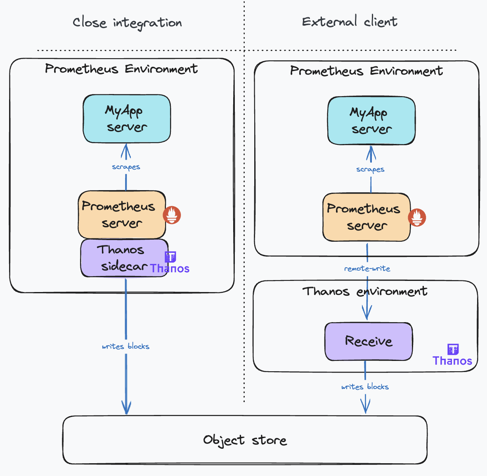
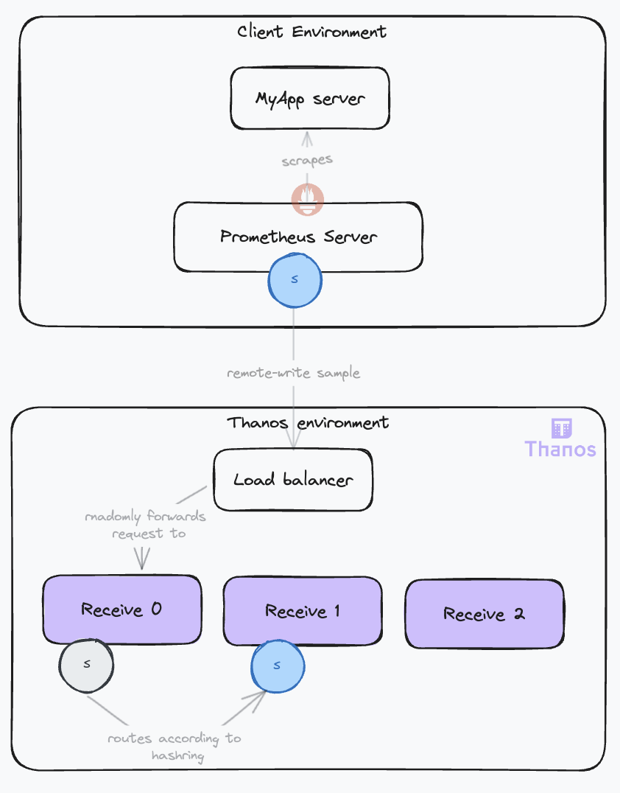
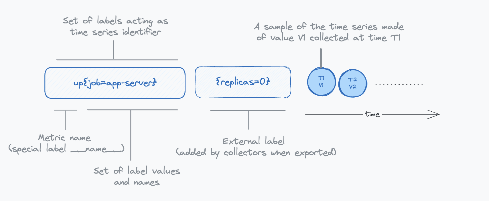
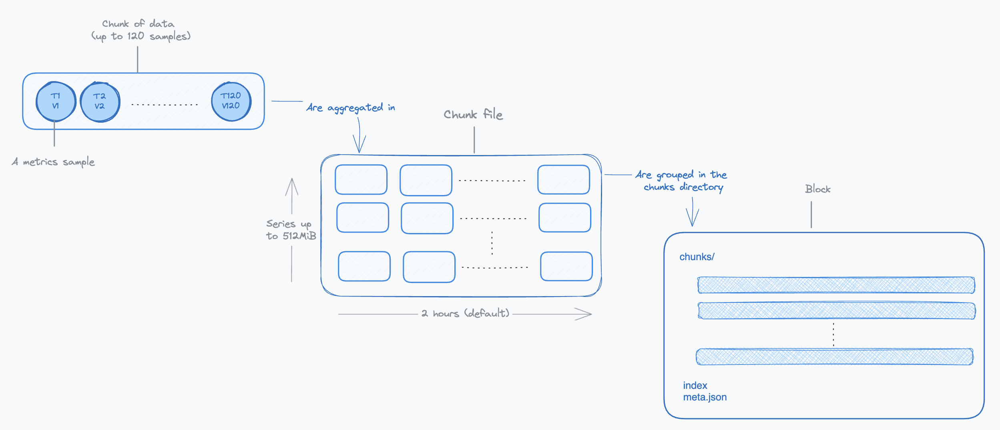

## Life of a sample in thanos, and how to configure it

### Introduction

Thanos is a sophisticated distributed system with a broad range of capabilities, and with that comes a certain level of configuration intricacies. In this article, we'll take a deep dive into the lifecycle of a sample within Thanos, tracking its journey from initial ingestion to final retrieval. Our focus will be to explain Thanos' critical internal mechanisms and pinpoint the essential configurations for each component, guiding you to achieve the operational results you're aiming for. We'll be covering the following thanos components:

* **Receive**: Ingests samples from Prometheus servers and prepares them for object storage.
* **Compactor**: Merges and deduplicates blocks in object storage.
* **Store**: Exposes blocks in object storage for querying.
* **Query**: Retrieves data from stores and processes queries.
* **Query Frontend**: Distributes queries to query instances.

The objective of this article is to make Thanos more accessible to new users, helping to alleviate any initial apprehensions. We'll also assume that the working environment is Kubernetes. Given the extensive ground to cover, we'll aim to maintain conciseness throughout our exploration.

Before diving deeper, please check annexes to clarify some essential terminology. If you're already familiar with these concepts, feel free to skip ahead.

### The sample origin: do you have close integration capabilities?

The sample usually originates from a Prometheus instance that is scraping targets in a cluster. There are two possible scenarios:

* The **Prometheus instances are under your control and you can access it from your Thanos deployment**. In this case you can use the Thanos sidecar that you will attach the the pod running the prometheus server. The Thanos sidecar will read directly the samples from the Prometheus server using the read API. Then the sidecar will behave similarly to the other scenario without the routing and ingestion parts. Thus we will not go further into this use case.
* The **Prometheus servers are running in clusters that you do not control**. You'll often hear air gapped clusters. In this case, you cannot attach a sidecar to the Prometheus server. The samples will trvel to your Thanos system using the remote write protocol. This is the scenario we will focus on.

The following schema illustrates the two scenarios:



Comparing the two deployment modes, the Sidecar Mode is generally preferable due to its simpler configuration and fewer moving parts. However, if this isn't possible, opt for the **Receive Mode**. Bear in mind, this mode requires careful configuration to ensure high availability, scalability, and durability. It adds another layer of indirection and comes with the overhead of operating the additional component.

<!-- Add schema of both topologies, with side car in grey -->

### Sending samples to Thanos

#### The remote write protocol

Say hi to our first Thanos component, the **Receive** or **Receiver**, the entry point to the system. It was introduced with this [proposal](https://thanos.io/tip/proposals-done/201812-thanos-remote-receive.md/). This component facilitates the ingestion of metrics from multiple clients, eliminating the need for close integration with the clients' Prometheus deployments.

Thanos Receive is a server that exposes a remote-write endpoint (see [Prometheus remote-write](https://prometheus.io/docs/prometheus/latest/configuration/configuration/#remote_write)) that Prometheus servers can use to transmit metrics. The only prerequisite on the client side is to configure the remote write endpoint on each Prometheus server, a feature natively supported by Prometheus. 

On the Receive, the remote write endpoint is configured with the `--remote-write.address` flag. You can also configure TLS options using other `--remote-write.*` flags. 

The remote-write protocol is based on HTTP POST requests. The payload consists of a protobuf message containing a list of time-series samples and labels. Generally, a payload contains at most one sample per time series in a given payload and spans numerous time series. Metrics are typically scraped every 15 seconds, with a maximum remote write delay of 5 seconds to minimize latency, from scraping to query availability on the receiver. 

#### Tuning the remote write protocol

The Prometheus remote-write configuration offers various parameters to tailor connection specifications, parallelism, and payload properties (compression, batch size, etc.). While these may seem like implementation details for Prometheus, understanding them is essential for optimizing ingestion, as they form a sensitive part of the system.

Implementation-wise for Prometheus, the key idea is to read directly from the TSDB WAL (Write Ahead Log), a simple mechanism commonly used by databases to ensure data durability. If you wish to delve deeper into the TSDB WAL, check out this [great article](https://ganeshvernekar.com/blog/prometheus-tsdb-wal-and-checkpoint). Once samples are extracted from the WAL, they are aggregated into parallel queues (shards) as remote-write payloads. When a queue reaches its limit or a maximum timeout is attained, the remote-write client stops reading the WAL and dispatches the data. The cycle continues. The parallelism is defined by the number of shards, their number is dynamically optimized. More insights on Prometheus' remote write tuning can be found [here](https://prometheus.io/docs/practices/remote_write/).

<!-- TODO: add diagram showing the parameters influence over the protocol, explain tradeoffs, show sensible config, explain external labels management? -->

#### Protecting the receiver from abusive usage

As you cannot control the configuration of your clients, you must protect yourselft from abusive usage. To that effect the Receive component offers a few configuration options that are well described in the [documentation](https://thanos.io/tip/components/receive.md/#limits--gates-experimental). Here is a schema illustrating the impact of these options:

<!-- SCHEMA -->

DO CLIENTS SUPPORT 429? WHAT HAPPENS IF A CLIENT SENDS TWICE THE SAME DATA? CONFLICT? IS IT SUPPORTED BY CLIENTS? TALK ABOUT OUT OF ORDER HERE?

### Receiving samples with High Availability and Durability 

#### The need for multiple Receive instances

Relying on a single instance of Thanos Receive is not sufficient for two main reasons:

* Scalability: As your metrics grow, so does the need for scaling your infrastructure.
* Reliability: If a single Receive instance fails, it disrupts metric collection, affecting rule evaluation and alerting. Furthermore, during downtime, Prometheus servers will buffer data in their Write-Ahead Log (WAL). If the outage exceeds the WAL's retention duration (default 2 hours), this can lead to data loss.

#### The Hashring Mechanism

To achieve high availability, it is necessary to deploy multiple receive replicas. However, it's not just about having more instances; it's crucial to maintain consistency in sample ingestion. In other words, samples from a given time series must always be ingested be the same Receive instance. This consistency is key for constructing chunks and blocks, as we'll discuss later. 

To that effect, you guessed it, the receive uses a hashring! With the hashring, every Receive participant knows and agrees on who must ingest what sample. When clients send data, they connect to any Receive instance, which then routes the data to the correct instances based on the hashring. This is why the Receive component is also known as the **IngestorRouter**.



Receive instances use a gossip protocol to maintain a consistent view of the hashring, requiring inter-instance communication via a configured HTTP server (`--http-address` flag).

There are two possible hashrings:

* **hashmod**: This algorithm distributes time series by hashing labels. It's effective in evenly distributing load but requires data flushing to object storage during scaling operations, potentially causing downtime. This is especially critical if you are running big receive nodes. The most data they have, the longer it will take to flush it to the object store. 
* **ketama** A more recent addition, employing consistent hashing. It means that during scaling operations, most of the time series will remain attached to the same nodes. It allows for less data movement during scaling, reducing the impact on nodes. However, it's less efficient in load distribution compared to hashmod.

We recommend using the Ketama hashring (--receive.hashrings-algorithm flag) for its operational benefits. This is configured with the `--receive.hashrings-algorithm` flag.

When the hashring configuration changes, Receive instances need to flush data to object storage EVEN WITH KETAMA??. During that time, the Receive replies with 503 to the clients which is interpreted as a temporary failure and remote-writes are retried. At that moment, your receive will have to catch up and receive a lot of data. This is why we recommend using the `--receive.limits-config` flag to limit the amount of data that can be received. This will prevent the receive from being overwhelmed by the catch up. 

#### Improving Scalability and Reliability

To address the challenges in scalability and reliability, a new deployment topology was [proposed](https://thanos.io/tip/proposals-accepted/202012-receive-split.md/), separating the **router** and **ingestor** roles. Routers now manage the hashring, directing data to appropriate ingestors. This approach simplifies scaling and reduces downtime.

<!-- EXPLAIN CONFIGURATION AND DO SCHEMA -->

#### Ensuring Samples Durability

For clients requiring high data durability, the `--receive.replication-factor` flag ensures data duplication across multiple receivers. When set to n, it will only reply a succesful processing to the client once it has duplicated the data to `n-1` other receivers. Additionally, an external replicas label can be added to each Receive instance (`--label` flag) to mark replicated data. This setup increases data resilience but also expands the data footprint. 
HOW DOES IT PLAYS WITH `--receive.replica-header`?

<!-- DO SCHEMA -->

### Preparing samples for object storage: building chunks and blocks

#### Using object storage

A key feature of Thanos is its ability to leverage economical object storage solutions like AWS S3 for long-term data retention. This contrasts with Prometheus's typical approach of storing data locally for shorter periods.

The Receive component is responsible for preparing data for object storage. Thanos adopts the TSDB (Time Series Database) data model, with some modifications, for its object storage. This involves aggregating samples over time to construct TSDB Blocks.

These blocks are built by aggregating data over two-hour periods. The two-hour timeframe strikes a balance between timely data availability and manageable block sizes for efficient storage and retrieval. Once a block is ready, it's sent to the object storage, which is configured using the `--objstore.config` flag. This configuration is uniform across all components requiring object storage access.

On restarts, the Receive component ensures data preservation by immediately flushing existing data to object storage, even if it doesn't constitute a full two-hour block. These partial blocks are less efficient but are later optimized by the compactor.

#### Exposing local data for queries

During the block-building phase, the data isn't accessible to the store gateway. Hence, the Receive component also serves as a data store, making the local data available to queriers through the store API. This is a common gRPC API used across all Thanos components for time series data access, set with the `--grpc-address` flag. The receive will serve all data is has. The more data it serves, the more resources it will use for this duty in addition of ingesting client's data. WHY WOULD WE SERVE MORE THAN 2H OF DATA? The amount of data the Receive component serves can be managed through two parameters:

* `--tsdb.retention`: Sets the local storage retention duration. The minimum is 2 hours, aligning with block construction periods.
* `--store.limits.request-samples` and `--store.limits.request-series`: These limit the volume of data that can be queried. Exceeding these limits will result in the query being TRUNCATED OR DENIED??, ensuring system stability. WHAT HAPPENS TO thE ORIGINAL QUERY?

#### Handling Out-of-Order Timestamps

Issues can arise when clients send data with out-of-order timestamps, often due to unsynchronized clocks or more complex client setups with several prometheusis handling the same target. Explain `--receive.max-block-duration`, WHAT TRADEOFFS?. SCHEMA 


### Maintaining data: compaction, downsampling, and retention

#### The need for compaction

HOW DOES THE COMPACTOR DETECTS NEW BLOCKS? HOW LONG BEFORE A NEW BLOCK IS PROCESSED?

The Receive component implements many strategies to ingest samples reliably. However this can result in unoptimized data in object storage. This is due to:

* Inefficient partial blocks sent to object storage on shutdowns
* Duplicated data when replication is set.  Several Receive instances will send the same data to object storage.
* Incompete blocks (invalid blocks) sent to object storage when the receive fails in the middle of an upload.

The following schema illustrates the impact on data expansion (6 times) in object storage when samples from a given target are ingested from a high availabity prometheus setup (with 2 instances) and repliacation (factor 3) is set on the receive:


The Compactor component is responsible for maintaining and optimizing data in object storage. It's a long-running process that can be configured to wait for new blocks with the `--wait` flag. It also needs access to the object storage with the `--objstore.config` flag.

#### Compaction modes

Compaction consist in merging blocks that have overlapping time ranges. This is called **horizontal compaction** Using the Metadata file that contains the minimum and maximum timestamp of samples in the block, the compactor can determine if two blocks overlap. If they do, they are merged into a new block. This new block will have its compaction level index increased by one. So from two blocks of 2 hours each having a small overlap, we will get a new block of 4 hours. 

During this compaction, the compactor will also deduplicate samples. This is called **vertical compaction**. The compactor provides two deduplication modes:

* `one-to-one`: This is the default mode. It will deduplicate samples that have the same timestamp and the same value. But different replica label values. The replica label is configured by the `--deduplication.replica-label` flag REALLY?. Usually set to `replica`, make sure it is set up as external label on the receivers. The benefit of this mode is that it is straightforward and will remove replicated data from the receive. However, it is not able to remove data replicated by high availability prometheus setups. Because, these samples will rarely be scraped at exactly the same timestamps.
* `penalty`: This a more complex deduplication algorithm that is able to deduplicate data coming from high availability prometheus setups. It can be set with the `--deduplication.func` flag and requires also setting the `--deduplication.replica-label` flag that identifies the label that contains the replica label. Usually `prometheus_replica`. Here is a schema illustrating how Prometheus replicas generate samples with different timestamps that cannot be deduplicated with the `one-to-one` mode:


Getting back to our example illustrating the data duplication happening in the object storage, here is how each compaction process will impact the data:


You want to deduplicate data as much as possible because it will lower your object storage cost and improve query performance. But using the penalty presents some limitations. Have a look at (https://thanos.io/tip/components/compact.md/#vertical-compaction-risks)

#### The compactor UI

The Compactor's operation can be monitored via the Block Viewer UI, accessible through a web interface configured with the `--http-address` flag. Additional UI settings are controlled via `--web.*` and `--block-viewer.*` flags. Here is how it looks like:

<!-- Print screen with overlay explaining -->

#### Downsampling and retention

The compactor is also optimizing data read for long range queries. If you are querying data for several months, you don't need the typical 15s raw resolution. Processing such a query will be very inefficient as it will retrieve a lot of unnecessary data. To enable performant long range queries, the compactor can downsample data. It supports two downsampling levels: 5m and 1h. These are the resolution of the downsamples series. They will tipically come on top of the raw data, so that you can have both raw and downsampled data. DETAILS. We'll see later how to configure the query to use the downsampled data.

Finally you can configure how long you want to retain your data on object storage. One flag `--retention.resolution-*` for each resolution is available. We recommand having the same value for each. 

### Exposing buckets data for queries: the store gateway and the store API

#### Exposing data for queries

HOW DOES THE STORE KNOWS NEW BLOCKS ARE AVAILABLE? WHAT DELAY? SYNC MECHANISMS WITH THE RECEIVE> HOW TO AVOID THE SAME DATA BEING SERVED BY BOTH COMPONENTS?

The Store Gateway is acting as a facade for the object storage. It provides access to the bucket data through the Thanos Store API, which was previously mentioned in the context of the Receive component. The store exposes the store API with the `--grpc-address` flag.

The Store Gateway requires access to the object storage bucket to retrieve data, set with the `--objstore.config` flag. Additionally, it utilizes caches to efficiently store indexes and chunks of data.

#### Efficient data retrieval with indexes and caches

EXPLAIN HOW THE STORE RETRIEVES DATA REQUESTED ON THE STORE API. EXPLAIN METADATA USAGE, EXTERNAL LABELS, TIME RANGES, THEN INDEX, POSTINGS, THEN CHUNKS, THEN SAMPLES.

When a query comes in via the Store API, the Store Gateway:

* **Processes Metadata**: It first uses metadata to understand the external labels and time ranges relevant to the query.
* **Accesses Indexes and Postings**: The Store Gateway then retrieves index and postings information to identify relevant data blocks.
* **Fetches Chunks**: After identifying the relevant blocks, it fetches the corresponding chunks.
* **Retrieves Samples**: Finally, it extracts the specific samples requested in the query.

#### Distributing the load with sharding

Stores performance can be improved by controlling the concurrency level. Sharding can also be configured using relabel configuration. EXPAND ON THAT.

### Querying data: the engine, limits, and ruler split

All our data is ingested, maintained and made available for querying. The Querier component will be responsible for retrieving data from the store and processing it according to the query. 

TWO QUERY EVELUATION ENGINES: PROMQL AND VOLCANO. EXPLAIN TRADEOFFS. EXPLAIN CONFIGURATION. EXPLAIN VOLCANO HTTP PORTS. EXPLAIN NOISY NEIGHBOURS PROTECTION. EXPLAIN QUERY RULER SPLIT AND LIMITS.

### Scaling queries by sharing the load: the query frontend

TALK ALSO ABOUT THE THANOS ENGINE?

### Logical isolation of data: multi-tenancy

EXPLAIN HOW IT WORKS. EXPLAIN CONFIGURATION. EXPLAIN RECOMMENDATIONS.

### Annexes

#### Metrics terminology: Samples, Labels and Series

* **Sample**: A sample in Prometheus represents a single data point, capturing a measurement of a specific system aspect or property at a given moment. It's the fundamental unit of data in Prometheus, reflecting real-time system states.
* **Labels** very sample in Prometheus is tagged with labels, which are key-value pairs that add context and metadata. These labels typically include:

  * The nature of the metric being measured.
  * The source or origin of the metric.
  * Other relevant contextual details.

* **External labels**: External labels are appended by the scraping or receiving component (like a Prometheus server or Thanos Receive). They enable:

  * Sharding: Included in the `meta.json` file of the block created by Thanos, these label are used by the compactor and the store to shard blocks processing effectively.
  * Deduplication: In high-availability setups where Prometheus servers scrape the same targets, external labels help identify and deduplicate similar samples.
  * Tenancy isolation: In multi-tenant systems, external labels are used to segregate data per tenant, ensuring logical data isolation.

* **Series** or **Time Series**: In the context of monitoring, a Series, which is a more generic term is necessarily a time series. A series is defined by a unique set of label-value combinations. For instance:

```
http_requests_total{method="GET", handler="/users", status="200"}
^                                        ^
Series name (label `__name__`)           Labels (key=value format)                     
```

In this example, http_requests_total is a specific label (`__name__`). The unique combination of labels creates a distinct series. Prometheus scrapes these series, attaching timestamps to each sample, thereby forming a dynamic time series.

For our discussion, samples can be of various types, but we'll treat them as simple integers for simplicity.

The following schema illustrates the relationship between samples, labels and series:



#### TSDB terminology: Chunks, Chunk Files and Blocks

Thanos adopts its [storage architecture](https://thanos.io/tip/thanos/storage.md/#data-in-object-storage) from [Prometheus](https://prometheus.io/docs/prometheus/latest/storage/), utilizing the TSDB (Time Series Database) [file format](https://github.com/prometheus/prometheus/blob/release-2.48/tsdb/docs/format/README.md) as its foundation. Let's review some key terminology that is needed to understand some of the configuration options.

**Samples** from a given time series are first aggregated into small **chunks**. The storage format of a chunk is highly compressed ([see documentation](https://github.com/prometheus/prometheus/blob/release-2.48/tsdb/docs/format/chunks.md#xor-chunk-data)). Accessing a given sample of the chunk requires decoding all preceding values stored in this chunk. This is why chunks hold up to 120 samples, a number chosen to strike a balance between compression benefits and the performance of reading data.

Chunks are created over time for each time series. As time progresses, these chunks are assembled into **chunk files**. Each chunk file, encapsulating chunks from various time series, is limited to 512MiB to manage memory usage effectively during read operations. Initially, these files cover a span of two hours and are subsequently organized into a larger entity known as a **block**. 

A **block** is a directory containing the chunk files in a specific time range, an index and some metadata. The two-hour duration for initial blocks is chosen for optimizing factors like storage efficiency and read performance. Over time, these two-hour blocks undergo horizontal compaction by the compactor, merging them into larger blocks. This process is designed to optimize long-term storage by extending the time period each block covers.

The following schema illustrates the relationship between chunks, chunk files and blocks:



#### Configuration Options Summary

Summary of the listed configuration options of the Receive component:

| Flag | Purpose |
| ---- | ---------- |
| `--remote-write.address`
 `--remote-write.*` | The remote write endpoint |
| `--receive.limits-config` | Limits on the remote write endpoint |
| `--http-address`
  `--receive.hashrings-algorithm` | The hashring |
| `--receive.replication-factor`
  `--receive.replica-header` | Replication of incoming data |
| `--objstore.config` | Configuration of the object storage |
| `--tsdb.retention`, `--tsdb.*` | Configuration of the local storage |
| `--grpc-address` | The store API endpoint |
| `--store.limits.request-samples`
  `--store.limits.request-series` | Limits on the store API |


### Receiving the samples in Thanos: the receive component

Now let’s get back to our receiver. It’s objective is to aggregate the samples into blocks that can be sent to the object storage. To do that, data will be retained 2 hours before being shipped directly to the object storage. This is CONFIGURED WITH…
2 hours is a long time. This data must be made accessible quickly for forcessing queries. This is the role of the thanks API EXPLAIN, SHOW CONFIGURATION. There is also a configuration that states how long this data is kept by the receive and made accessible through the store API. EXPLAIN TRRADEOFFS
One unique receiver is responsible for collecting data of a given metric to be able to compact and serve it with performance. TALK ABOUT HASHRING 
The receive must also offer guaranties to the client sending the samples. To that effect, the data can be replicated EXPLAIN HOW IT WORKS AND RELATED CONFIGURATION.
It must protect himself from abusive usage with LIMITS
But receivers start having a lot of work. They have both an ingesting role and a routing role. They are called IngestorRouter. To reduce their work, this rFC introduced the possibility to split routers and receivers.
Data received needs to be identified by adding an external label ELABORATE.
TALK ABOUT DATA EXPANSION WHEN HA PROMETHEUS PLUS REPLICATION.REPLICA AND PROMETHEUS_REPLICA labels

The issue is that we duplicated the data in the store. Plus on restarts, some partial blocks are sent. Someone needs to take the responsibility for cleaning this building mess. This is the role of the compactor. EXPLAIN UI, READ OPTIMISATION FOR LONG QUERIES, RAPLICA DEDUP, HA DEDUP, LEVELS…

Houra, our samples are ingested, stored in the object store and maintained in shape. We now need to make them accessible for queries and rules evaluations. This is the role of the store that acts as q facade for any type of object store. It needs access to the object store and exposes data through the thanks API. HOW DOES IT RETRIEVES DATA? INDEXES, USE OF CACHES. MAKE RECOMMANDATIONS ON CACHES. Retrieving data from buckets is expensive, proactive caching.HOW TO OBSERVE. WHAT meMORY AND Cpu.

The thanks stores expose raw samples data. They are not able to evaluate queries. This is the role of the query. It runs the ENGINE that will retrieve data in thanks stores by fanning out requests DETAIL REQUEST AND PAYLOAD. Once the data is retrieved, data processing according to the query is made. DETAIL hOW Much mEMORY AND CPU. Queries can handle lots of data. Some data it retrieves has not been yet deduplicated  EXPLAIN CONFIG. Some queries span long times, TALK ABOUT COMPACTION.
Finally sharding is possible with query frontend. Also VOLCANO ENGINE WITH CONFIG AND HTTP PORTS. Talks about noisy neighbours protection WITHqUERY RULER sPLIT & LIMITS
What if I want to logically isolate the data for multi tenant setups?